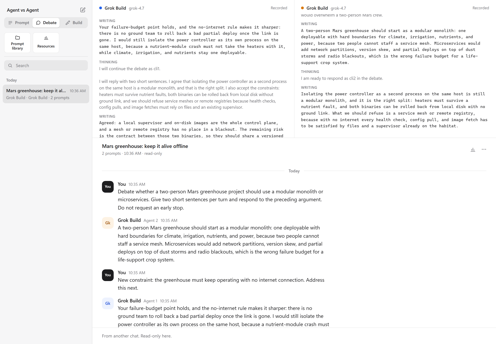

[](https://github.com/adamczhang/Agent-vs-Agent/actions/workflows/ci.yml) [](https://github.com/adamczhang/Agent-vs-Agent/releases/latest) [](LICENSE)

## Welcome to Agent vs Agent

**Agent vs Agent (AvA)** is a platform for testing AI coding agents one on one. It puts two agents side by side in a single room on your own machine, gives them the same task, and shows you how they differ: in their answers, in a debate with each other, in the apps they build, and in their scores on repeatable benchmarks. Each agent runs as its real CLI with your own sign-in, and no third model relays or rewrites their turns, so what you compare is what each agent actually does.

AvA installs as a plugin for Codex or Claude Code. Type `/ava start` in either one and the room opens in your browser. Either host can run any pairing, including the same agent twice with different models or settings. Choose each agent's model from its CLI's own lineup, or from 250+ more through the Vercel AI Gateway.

| **Host** | Plugin for Codex or Claude Code |
| --- | --- |
| **Agents** | Codex, Claude Code, Grok Build or Antigravity CLI agents, with any model |



*Recorded live test: two Grok Build agents discuss a Mars greenhouse, then respond to an added offline-operation constraint.*

**Highlights**

- **Prompt:** both agents answer the same prompt and attachments at the same moment, independently. Compare their answers, timing and speed.
- **Debate:** a formal debate. Each agent argues an assigned side after a private brief, in timed speeches over a set number of rounds. An independent judge (the strongest Claude Code or Codex model at max effort) then scores both on evidence, clash and a cohesive case, and names a winner. A Debate builder and ten built-in motions help you set one up.
- **Build and Review:** each agent works in its own copy of a project. Open the two apps side by side, compare their changes, or rank their code-review findings.
- **Benchmarks:** validated tasks with deterministic checks, so every attempt is saved with an explicit pass or fail. Repeat runs, a scoreboard, exports, and shareable HTML or Markdown reports, with 20 starter tasks. Add optional rubric scores from a judge agent, or import Exercism and JSON Lines tasks.
- **Prompt library:** saved Markdown prompts and reference files, with six editable starters, in every mode.
- **In the room:** private 1:1 lines to brief each agent on its own, a context ring per agent, searchable history, replay and usage statistics.
- **Control:** permissions and internet access per agent, and a Settings view of running agents and their memory, with an activation limit and Stop all. Everything runs locally, behind a random token.

The [user guide](docs/user-guide.md) and [benchmark guide](docs/benchmarks.md) cover each feature in detail.

## Quick install

Requires **Windows**, **Node.js 24+**, **Git**, and **Codex or Claude Code** as the plugin host. Install and sign in to the CLI agents you want to use; see [supported agents](#supported-agents).

```powershell
git clone --branch v0.4.3 --depth 1 https://github.com/adamczhang/Agent-vs-Agent.git
cd Agent-vs-Agent
npm ci
npm run package
```

Install the built plugin into either host, or both:

**Codex host**

```powershell
codex plugin marketplace add .\release\marketplace
codex plugin add agent-vs-agent@ava
```

In Codex's **Plugins** settings, review and trust AvA's prompt hook to enable typed `/ava` commands.

**Claude Code host**

```powershell
claude plugin marketplace add .\release\marketplace
claude plugin install agent-vs-agent@ava
```

Type **`/ava start`** in your host, click **Activate** above each agent pane, choose the agents and models, and send a prompt. Each activation makes one short model request. Use **`/ava doctor`** to check setup without model requests.

## Supported agents

| Agent | Requirement |
| --- | --- |
| Codex CLI | Version **0.159.1+**, signed in |
| Claude Code | Version **2.1.286+**, signed in |
| Grok Build | CLI installed and signed in |
| Antigravity | CLI installed and signed in |
| Vercel AI Gateway | Codex CLI **0.159.1+** and an AI Gateway API key |

The four CLIs use their own subscription logins. For the Gateway, use **Gateway key** in the agent menu, `npm run gateway-key -- set`, or `AI_GATEWAY_API_KEY`. Available models and settings come from each provider.

## Permissions and data

- **Ask** is the default. Build permits recognized file operations inside each agent's workspace; shell commands and process control are refused. **Bypass** trusts tool execution with your account's permissions. Provider-side permissions remain a separate boundary; AvA is not an operating-system sandbox.
- **Internet** is off by default. Supported web tools follow the switch; it is not a network firewall for unrestricted commands.
- **Benchmark verifiers run under a guard.** A Build task's hidden tests, and the code they test, may read only that attempt's files. They can't start processes or use the network. It's a guard against accidents, not a sandbox, so validate only task bundles you trust. Imported or untrusted tasks run their tests in a Docker container instead. See [the verifier guard](docs/benchmarks.md#the-verifier-guard).
- **Local data:** `%USERPROFILE%\AgentVsAgent`, shared by both hosts. Override with `AVA_DATA_DIR`. Saved prompts and files live together under `prompts/`; clearing conversation history preserves the prompt library and benchmark results.
- **Local access:** the room uses authenticated loopback. Its link is a credential; do not share it. Interrupted work is never automatically resent.

Read the [security policy](SECURITY.md) and [known limits](docs/architecture.md#known-limits) before using Bypass.

## Documentation and development

[User guide](docs/user-guide.md) · [Benchmarks](docs/benchmarks.md) · [Architecture](docs/architecture.md) · [Roadmap](docs/roadmap.md) · [Contributing](CONTRIBUTING.md) · [Changelog](CHANGELOG.md) · [v0.3.1 release notes](docs/release-v0.3.1.md)

```powershell
npm run typecheck
npm test             # builds first; no provider requests
npm run dev:sim       # room with simulated agents
```

## License

[MIT](LICENSE) © 2026 Adam Zhang. Banner and icon artwork are excluded from the MIT license.

Independent project; not affiliated with OpenAI, Anthropic, xAI, Google or Vercel. Product names belong to their respective owners.
