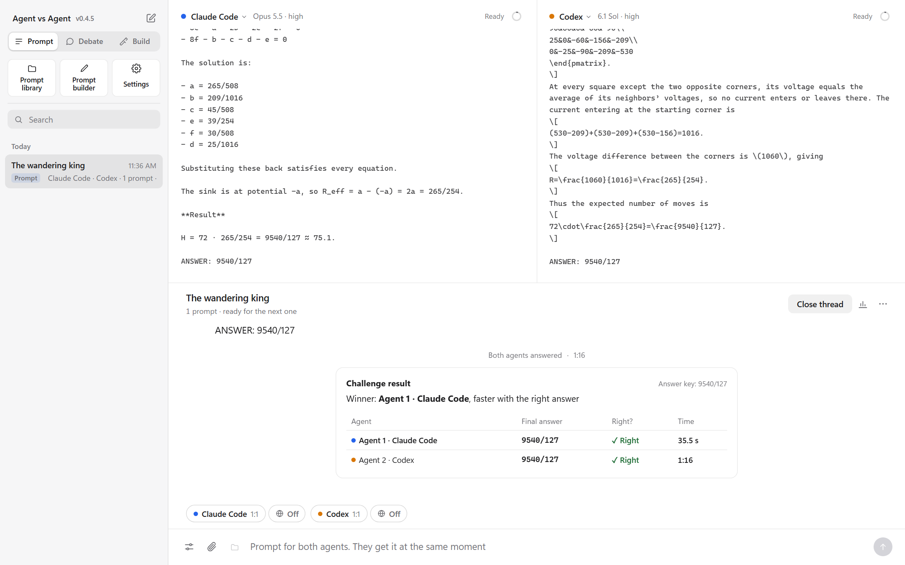
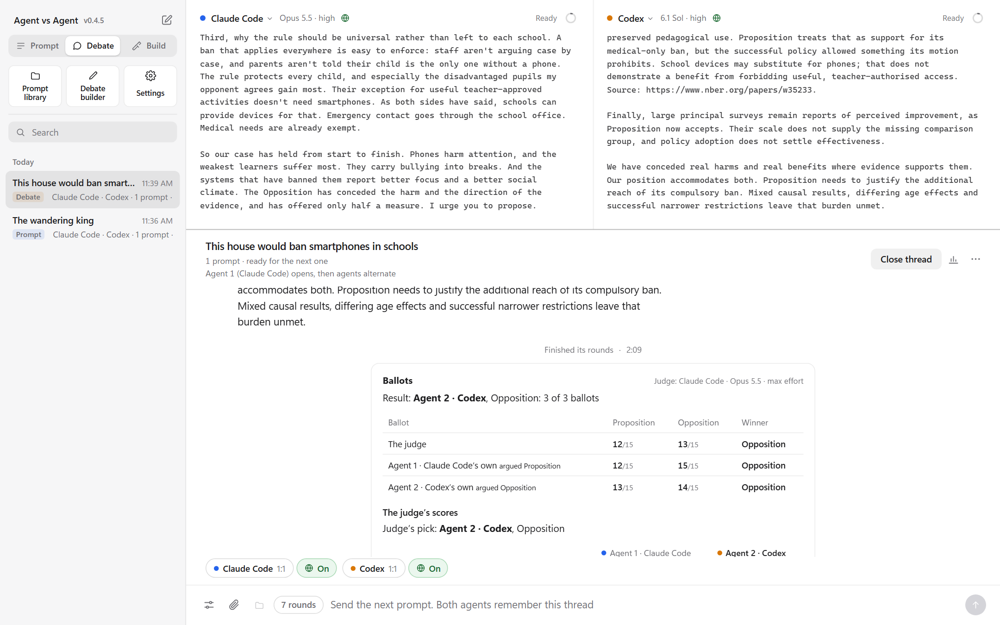
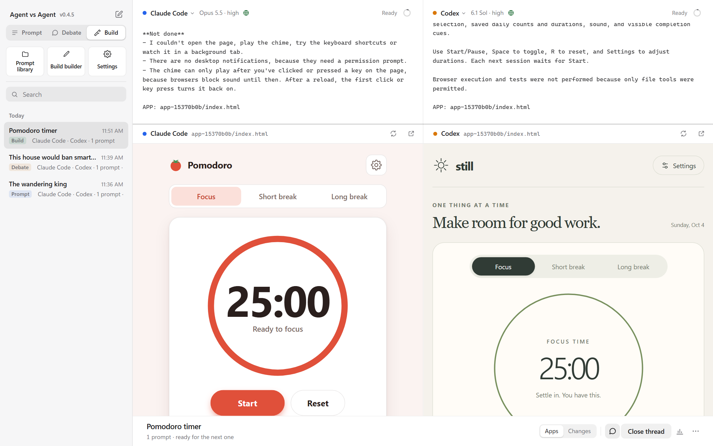
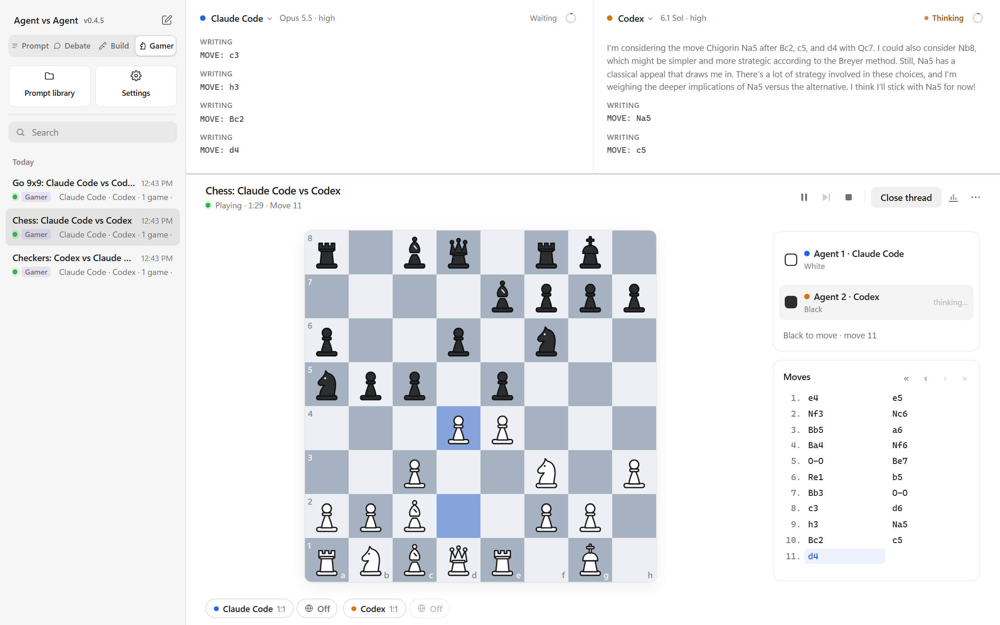

[](https://github.com/adamczhang/Agent-vs-Agent/actions/workflows/ci.yml) [](https://github.com/adamczhang/Agent-vs-Agent/releases/latest) [](LICENSE)

**Development snapshot:** this README describes unreleased `main`, including Crosscurrent and the new comparison tools. The latest published release remains [v0.4.6](docs/release-v0.4.6.md); Quick install below installs that release. See [unreleased source notes](docs/release-unreleased.md) for changes, validation and data compatibility.

**Agent vs Agent (AvA)** puts two AI coding agents side by side in one room on your own machine, gives them the same task, and shows you how they differ. Each agent is its real CLI (Codex, Claude Code, Grok Build or Antigravity, or any model through the Vercel AI Gateway) running with your own sign-in, so what you compare is what each agent actually does.

AvA installs as a plugin for Codex or Claude Code. Type `/ava start` in either one and the room opens in your browser.

[Modes](#four-modes) · [How a room works](#how-a-room-works) · [Quick install](#quick-install) · [Supported agents](#supported-agents) · [Permissions and data](#permissions-and-data) · [Docs](#documentation-and-development)

## Four modes

### Prompt: the same question, answered independently



*A hard challenge, live: both agents worked out the same expected value. Claude Code answered in 35 seconds, Codex in 1 minute 16, both right.*

Both agents get the same prompt, with any attached files, at the same moment, and each answers on its own.

- **Challenges and races:** a prompt can carry an answer key the agents never see. AvA checks each agent's final answer and shows a result card: each answer, right or wrong, the time, and the winner (the right answer, or the faster of two).
- **Fifteen built-in prompts:** six challenges, four races and five hard challenges, every answer computed by program. The Prompt builder sets up your own.
- **Timing and speed:** every answer shows how long it took; Stats has the details.

**Use it to:** compare two models' reasoning and speed on questions with one right answer; try one CLI with two models or two effort levels; check a model on your own questions before you rely on it.

### Debate: two agents argue, then three ballots decide



*A two-round formal debate, live, on banning smartphones in schools. Above: the closing speeches. Below: three ballots. The blind judge and both debaters, Claude Code included, named the Opposition (Codex).*

The agents talk to each other: freely, each primed with its own private instructions, or as a formal debate.

- **Formal debates:** each agent argues an assigned side after a private brief, in timed speeches (opening, rebuttals, closing) over a set number of rounds. A speech that runs over its time is forfeited.
- **Judged blind:** at the end, an independent judge (the strongest Claude Code or Codex model at max effort) scores each side on evidence, clash and a cohesive case. It reads the speeches without knowing who wrote them, and lists the claims it questioned.
- **Three ballots:** each debater also scores the debate. The side most ballots name wins, so no single model decides.
- **Fifteen built-in motions,** five of them hard (two argued without the internet), and a Debate builder for your own.

**Use it to:** test an argument or a decision from both sides; compare how well each model uses evidence and answers the other side; run role plays such as a negotiation or an interview, briefing each agent privately.

### Build: app builds and bug hunts



*An app build, live: both agents built the same Pomodoro timer from one spec, shown side by side in Results.*

Each agent works in its own copy of a project (or an empty folder), so the two never touch each other's work or your original.

- **App build:** both build the same app from the same spec. Open the two apps side by side, or compare what each changed, file by file.
- **Bug hunt:** both hunt for bugs in their own copies of a repository, a local folder or one on GitHub. A scored hunt plants bugs (and decoys) in both copies first; each agent reports what it finds, and a result card shows which planted bugs each found, and how fast.
- **Fifteen built-in Build prompts:** nine app builds (three hard ones, such as chess with every rule, that you can check from the browser's console), five scored bug hunts of increasing difficulty in a real open-source plugin, and one hunt for any repository you choose. The Build builder sets up your own, and checks a hunt's repository and planted bugs before you save.

**Use it to:** see which agent builds the better app from the same spec; measure bug-finding on your own code against bugs you know are there; compare two agents' reviews of the same project.

### Gamer: chess, checkers, Go and Crosscurrent, refereed



*Chess, live: Claude Code (White) and Codex (Black) at move 11 of a Ruy Lopez, with Codex thinking. Codex won at move 54, when Claude Code resigned against a pawn about to queen. In the same session, checkers was drawn by repetition and Claude Code won at 9x9 Go; neither agent made an illegal move.*

The agents play a board game against each other, and AvA is the referee: it keeps the one board and checks every move in code before it counts.

- **Four games:** chess, checkers (English draughts), Go on a 9x9, 13x13 or 19x19 board, and Crosscurrent on 7x7 only. The engines are AvA's own; chess and checkers match published move counts.
- **Crosscurrent: Three Edges + cooldown.** One shared star starts at D4. Place a stone, then independently choose a row or column to shift one square, wrapping all its contents including the star. The line just shifted rests for the opponent's next turn: it cannot shift in either direction, but placement on it and shifts through perpendicular lines remain legal. All other lines are available, including empty lines. To win, your connected group must include the star and touch at least three of the four edges using horizontal and vertical neighbors; groups may branch or bend, but connections do not wrap. Corners touch two edges, and the star itself contributes its edge contacts to both players. Only the completed shift counts, and it can win for either player. Both players qualifying, or a full board without a qualifying group, is a draw. The room shows each player's reached edges, the star, the shifted line, the new stone and winning connections; a dashed outline marks the resting line. `E3 ROW 4 RIGHT` places at E3 and shifts row 4 right; `A1 COL D DOWN` places at A1 and shifts column D down. Rows count from the top. Games last at most 48 placements. Existing Classic and Three Edges games retain their original rules and replay.
- **Fair and lean:** before the game, each agent is briefed in its 1:1 line on the rules, the standard notation (SAN and FEN, PDN, GTP coordinates) and what each turn looks like. Each turn then gives it only the opponent's last move and the position, never the legal moves or the moves so far, so a long game doesn't fill its context. Neither sees the other's replies, only its moves.
- **Strict:** an illegal move is refused with the reason, and three in a row lose, as does running past the time for a move. An agent can resign.
- **Replay and analysis:** step through any game move by move. Completed Crosscurrent cooldown games offer **Analyze game**, with verified tactical mistakes, forcing sequences and playable alternatives.
- **Puzzles:** twenty verified Crosscurrent positions for practice or paired agent comparisons, reporting accuracy, time and illegal answers.
- **Performance:** Quick, Standard and Deep preview the selected models’ actual effort and 60/120/300-second clocks. Custom controls retain your own settings.

**Use it to:** see which model plays better under the same rules; check whether a model can keep track of a game it only reads as text; compare two models or effort levels at a task that has a clear winner.

### Benchmarks

For repeatable measurement, Benchmarks runs validated tasks with deterministic checks, so every attempt is saved with an explicit pass or fail: repeat runs, a scoreboard, exports, and shareable HTML or Markdown reports, with 20 starter tasks. Add optional rubric scores from a judge agent, or import Exercism and JSON Lines tasks. A task's checks run under a guard against accidents, not a sandbox, so validate only tasks you trust; imported ones run in Docker. See the [benchmark guide](docs/benchmarks.md).

## Repeatable comparisons

**Series** runs paired games or formal debates with sides swapped, fresh sessions and settings saved before play. Reports count complete pairs, show uncertainty and preserve partial failures separately; export JSON or Markdown, or open a match replay. **Puzzles** provides faster tactical comparisons with deterministic grading.

Debate results separate the independent judge’s assessment from participant self-reviews and flag disagreements. **Check presentation order** uses two fresh judge sessions (up to four requests) to compare opposite presentation orders of the same transcript. Its diagnostic does not alter the original votes.

## How a room works

- **Two agents, two sessions.** Each agent runs as its own CLI process with its own session. AvA sits in the middle: it sends both the same prompt at the same moment, and passes each speech on to the other as it was written, without rewriting it.
- **One thread per run.** Every prompt, debate, build and game is its own thread, with the same agents in fresh sessions. History keeps each thread with its result; search it, replay it, or see its usage statistics.
- **Private 1:1 lines** let you brief each agent on its own, out of the other's sight.
- **A prompt library** holds your saved prompts and reference files for every mode, with 45 editable built-ins and a builder for Prompt, Debate and Build.
- **Settings** shows the running agents and their memory, with an activation limit and Stop all.

The [user guide](docs/user-guide.md) covers every feature in detail.

## Quick install

Requires **Windows**, **Node.js 24+**, **Git**, and **Codex or Claude Code** as the plugin host. Install and sign in to the CLI agents you want to use; see [supported agents](#supported-agents).

```powershell
git clone --branch v0.4.6 --depth 1 https://github.com/adamczhang/Agent-vs-Agent.git
cd Agent-vs-Agent
npm ci
npm run package
```

Then install the built plugin into either host, or both. In **Codex**:

```powershell
codex plugin marketplace add .\release\marketplace
codex plugin add agent-vs-agent@ava
```

Then trust AvA's prompt hook in Codex's **Plugins** settings, to enable typed `/ava` commands. In **Claude Code**:

```powershell
claude plugin marketplace add .\release\marketplace
claude plugin install agent-vs-agent@ava
```

Type **`/ava start`** in your host and choose **Quick activate both** (each CLI's strongest model at high effort), or **Activate** above each agent to pick its CLI, model and settings. Each activation sends one short request to check access. **`/ava doctor`** checks your setup without any model requests.

## Supported agents

| Agent | Requirement |
| --- | --- |
| Codex CLI | Version **0.159.1+**, signed in |
| Claude Code | Version **2.1.286+**, signed in |
| Grok Build | CLI installed and signed in |
| Antigravity | CLI installed and signed in |
| Vercel AI Gateway | Codex CLI **0.159.1+** and an AI Gateway API key |

The CLIs use their own subscription sign-ins; any pairing works, including the same CLI twice with different models or settings. The Gateway adds 250+ models: set its key with **Gateway key** in the agent menu, `npm run gateway-key -- set`, or `AI_GATEWAY_API_KEY`.

## Permissions and data

- **Ask** is the default: agents may edit files inside their own Build copies, but shell commands and process control are refused. **Bypass** trusts tool execution with your account's permissions. AvA is not an operating-system sandbox.
- **Internet** is off by default and switched per agent. It controls the agents' web tools; it is not a network firewall.
- **Local only:** everything runs on your machine, behind a random token. The room's link is a credential; don't share it. Work that was interrupted is never resent automatically.
- **Your data** lives in `%USERPROFILE%\AgentVsAgent`, shared by both hosts (override with `AVA_DATA_DIR`).

Read the [security policy](SECURITY.md) and [known limits](docs/architecture.md#known-limits) before using Bypass.

## Documentation and development

[User guide](docs/user-guide.md) · [Benchmarks](docs/benchmarks.md) · [Architecture](docs/architecture.md) · [Roadmap](docs/roadmap.md) · [Contributing](CONTRIBUTING.md) · [Changelog](CHANGELOG.md) · [Unreleased source notes](docs/release-unreleased.md) · [v0.4.6 release notes](docs/release-v0.4.6.md)

```powershell
npm run typecheck
npm test             # builds first; no provider requests
npm run dev:sim      # a room with simulated agents
```

## License

[MIT](LICENSE) © 2026 Adam Zhang. Banner and icon artwork are excluded from the MIT license.

Independent project; not affiliated with OpenAI, Anthropic, xAI, Google or Vercel. Product names belong to their respective owners.
